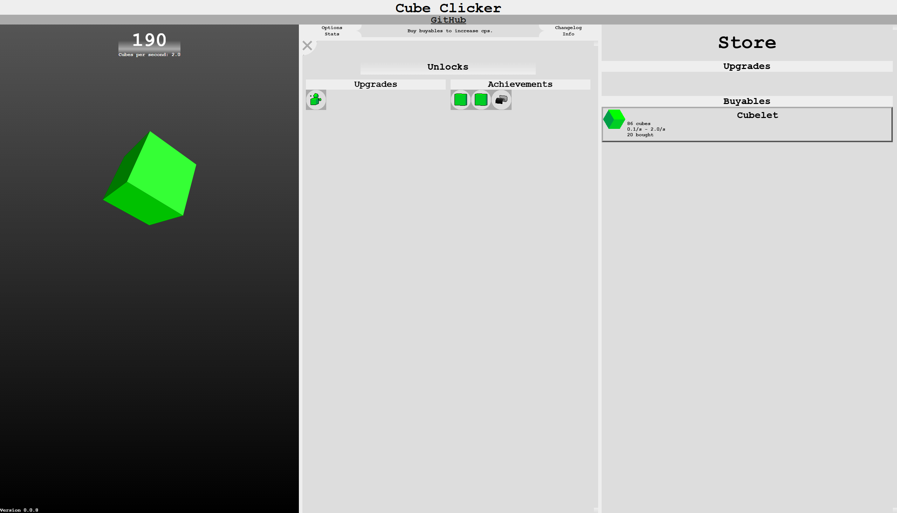

# Cube Clicker

Cube Clicker is a simple incremental game in the style of Cookie Clicker, built with Node + Express and vanilla JS.

This project is a vertical slice demo of a typical clicker game, including one buyable, and a few upgrades and achievements relating to it.



## Features
- Click to earn cubes, buyables, upgrades and achievements.
- Persistent saves (local + server accounts).
- Static assets served for client UI.

## Quick start

1. Install dependencies
    ```sh
    npm install
    ```

2. Run locally
    ```sh
    node app.js
    ```

3. Open in browser
    - http://localhost:5000/index

## Development notes
- Server entry: app.js — handles views and account endpoints.
- Client UI and game logic: client/script.js.
- Styles: css/style.css.
- Build / packaging: none required; static app.

## Project layout
- app.js — Express server
- package.json — project metadata / deps
- client/script.js — game logic, classes: Buyable, Upgrade, Achievement, logic for the rotating cube rendering
- css/style.css — styles
- views/*.ejs — server-rendered pages
- images/, audio/ — static assets
- accounts.json — simple user store (for development)

## License
[MIT]

[MIT]: https://choosealicense.com/licenses/mit/